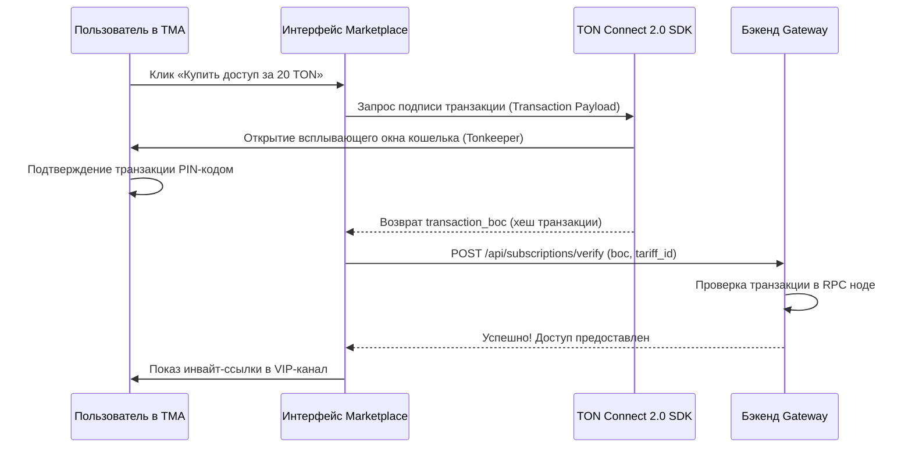

# Frontend Specification & UI Prompt: AlphaHub Telegram Mini App

**Автор**: Sally (UX Expert BMad Agent)  
**Статус**: Production Spec & AI UI Prompts  
**Стек UI**: React 19, TypeScript, TailwindCSS, Shadcn/ui (Telegram Dark Theme)

---

## 1. Цветовая палитра и Темизация (Telegram Integration)

Mini App должен выглядеть бесшовно интегрированным в мессенджер, поэтому стили базируются на CSS-переменных Telegram WebApp API. Мы модифицируем тему под премиальный неоново-темный интерфейс (Neon Dark) с эффектом матового стекла (Glassmorphism).

| Элемент UI | Переменная Telegram | Hex (Fallback) | Использование |
| :--- | :--- | :--- | :--- |
| **Основной фон** | `--tg-theme-bg-color` | `#1c1c1e` | Задний план приложения |
| **Вторичный фон** | `--tg-theme-secondary-bg-color` | `#2c2c2e` | Карточки, листы, поля ввода |
| **Основной текст** | `--tg-theme-text-color` | `#ffffff` | Заголовки, основной контент |
| **Подсказки / Лимиты** | `--tg-theme-hint-color` | `#8e8e93` | Подписи, серый текст, даты |
| **Основная кнопка** | `--tg-theme-button-color` | `#0088cc` | Кнопка «Купить», «Подключить» |
| **Текст на кнопке** | `--tg-theme-button-text-color` | `#ffffff` | Текст внутри кнопок |
| **Акцент (ROI +)** | `-` | `#30d158` | Положительный PnL (Неоновый зеленый) |
| **Акцент (ROI -)** | `-` | `#ff453a` | Отрицательный PnL (Неоновый красный) |

---

## 2. Информационная Архитектура (Иерархия экранов)

Приложение состоит из 3-х главных вкладок с нижним таб-баром (Bottom Navigation):

```
                   [ Telegram Mini App "AlphaHub" ]
                                  |
         +------------------------+------------------------+
         |                        |                        |
[ Tab 1: RADAR ]          [ Tab 2: MARKETPLACE ]   [ Tab 3: CABINET ]
 * Search Wallets          * Trader Cards           * Channels Config
 * Live Wallet List        * Proof-of-Trade Charts  * Tariff Settings
 * Push Toggle Switches    * Buy Tariff Sheet       * Signals Management
```

### Экран 1: «Радар (Smart Money)» (B2C)
1. **Header:** Статус подключения кошелька (Кнопка `TON Connect`).
2. **Search Bar:** Поле ввода адреса кошелька (с автоопределением сети TON/Base/Solana) и кнопка «Добавить».
3. **Tracked List:** Список карточек отслеживаемых кошельков:
   * Название кошелька (Label), укороченный адрес (`0x...3a`).
   * Сеть (иконка TON, Solana или Base).
   * Суммарный ROI за 30 дней (динамический зеленый/красный спарклайн-график).
   * Переключатель (Switch) «Push Notifications» для мгновенных уведомлений в бота.
4. **Wallet Detail Sheet:** Выезжающая шторка при клике на кошелек кита:
   * Детализация баланса (общая сумма в USD, список токенов).
   * Последние 10 транзакций (DEX, пара, объем, тип BUY/SELL, время).
   * Кнопка `[ Настроить авто-копирование ]`.

### Экран 2: «Маркетплейс трейдеров» (B2B/B2C)
1. **Фильтры:** Быстрые теги: `TON`, `Solana`, `Base`, `Высокий ROI`, `Memecoins`.
2. **Рейтинг (Leaderboard):** Список карточек верифицированных трейдеров:
   * Аватар, имя, ссылка на Telegram-канал.
   * ROI (%) и Winrate (%) за 30 дней.
   * Виджет реального ончейн-графика доходности (Proof-of-Trade).
3. **Trader Profile (Интерактивная витрина):**
   * Вся история сделок трейдера (когда купил, когда закрыл, PnL по каждой сделке).
   * Блок тарифов подписки (например, `1 месяц - 20 TON`, `3 месяца - 50 TON`).
   * Кнопка покупки подписки (активирует TON Connect транзакцию или Telegram Stars платеж).

### Экран 3: «Кабинет автора» (B2B для админов)
1. **Панель верификации:** Статус привязки канала. Инструкция по добавлению бота в администраторы канала.
2. **Trader Wallet Setup:** Управление кошельками, с которых парсится Proof-of-Trade.
3. **Tariff Designer:** Настройка длительности и цен доступа в VIP (TON/USDT/Stars).
4. **Active Signals Cabinet:** Управление ручными сигналами (если не используется авто-парсинг) и лог оплат подписчиков.

---

## 3. Интерактивные Сценарии Пользователя (User Flows)

### Сценарий: Покупка подписки через TON Connect



---

## 4. Промпт для AI Генераторов UI (v0.dev / Lovable.dev)

Этот детальный промпт можно скопировать и вставить в v0.dev или Lovable для генерации премиального интерактивного фронтенда.

```text
Create a premium, modern, glassmorphic Telegram Mini App interface for a Web3 Social Trading platform named "AlphaHub". 
The design system must strictly use Telegram Dark Theme variables with neon accents:
- Base Background: Dark slate/ebony (#121214)
- Secondary/Card Background: Translucent dark grey (#1a1a1e) with backdrop-filter: blur(12px) and subtle 1px border (#2e2e34)
- Primary Accent: Neon blue (#00a2ff) for buttons and active states
- Success/Profit: Neon green (#2ed573)
- Warning/Loss: Neon red (#ff4757)
- Text Primary: Pure white (#ffffff)
- Text Secondary: Cool gray (#8a8a93)

Layout Structure:
1. Bottom Navigation Bar:
   - 3 Tabs: "Radar" (icon: Radar), "Marketplace" (icon: Trophy/TrendingUp), "Cabinet" (icon: Settings/User).
   
2. TAB 1: Radar (Smart Money Tracker)
   - Header: Display "AlphaHub Radar" and a "Connect Wallet" button using TON Connect styled button.
   - Search/Add Wallet Input: A sleek input bar with network selector dropdown (TON, Base, Solana) and a "+" add button.
   - Monitored Wallets List: 
     - Render 3-4 interactive cards.
     - Card content: Wallet alias (e.g. "Solana Whale #2"), truncated address ("0x71c...a4"), sparkline PnL graph (use neon green/red SVG paths), monthly ROI badge (+142.5% or -12.4%), and a toggle switch for Telegram push alerts.
     - Clicking a card opens a slide-up drawer (sheet) showing wallet details: balance, list of last 5 trades (Token symbol, type BUY/SELL, amount, execution time, and a "Copy Trade" button).

3. TAB 2: Marketplace (Trader Leaderboard)
   - Filter chips at the top: "All", "TON", "Base", "Solana", "High Winrate".
   - Trader Cards List:
     - Render 3 cards showing verified traders.
     - Card content: Avatar, display name, winrate (e.g., "Winrate: 89%"), ROI ("30d ROI: +312%").
     - An interactive area containing a mini line chart showing cumulative profit trend.
     - A clean button "View Profile" which expands or navigates to a profile detail view.
     - Detail view contains a tariff selector (e.g., "1 Month - 15 TON", "3 Months - 40 TON") and a prominent CTA "Subscribe & Join Channel" which triggers a loading state mimicking wallet transaction approval.

4. TAB 3: Author Cabinet (B2B Console)
   - "Verify Channel" section showing a checklist: [x] Add Bot to Admins, [ ] Set Channel Link, [ ] Configure Tariffs.
   - Wallet Management: Add/edit the trading addresses that will be used to generate the "Proof-of-Trade" track record.
   - Tariff Configuration cards: Inputs for price (TON/Stars) and duration.
   - "Active Signals" log: displaying currently open trade positions with live ticks of floating profit/loss.

All transitions must be smooth. Buttons must have hover/active states with haptic-like micro-scaling. Font should be Inter or Outfit. Make it feel extremely premium, similar to Cielo.finance or Rabby Wallet interfaces.
```
