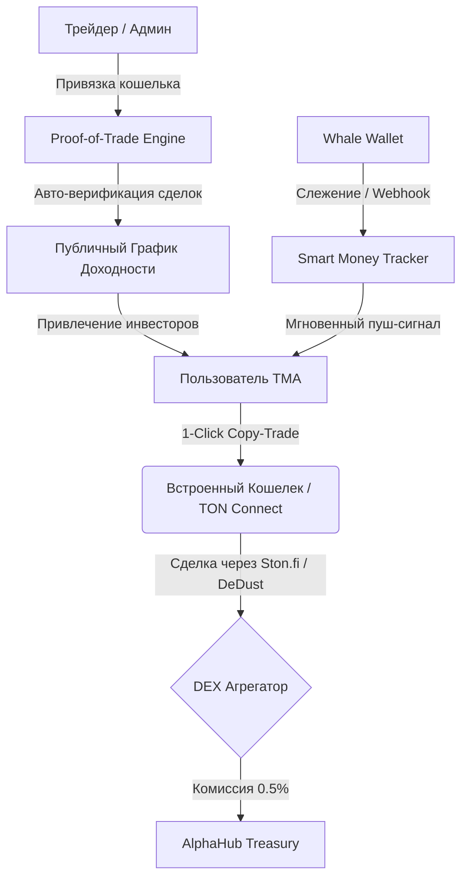

# Product Concept: AlphaHub - The Proof-of-Alpha & Social Copy-Trading Protocol

**Автор**: John (Product Manager BMad Agent)  
**Статус**: Черновик Концепта (Draft Concept)  
**Целевая аудитория**: Web3-трейдеры, инфлюенсеры, владельцы приватных каналов, розничные инвесторы в сети TON, EVM (Base) и Solana.

---

## 1. Введение и Критический Анализ Исходного ТЗ

Исходное техническое задание (ТЗ) «AlphaHub» предлагает прочную основу для MVP. Однако в его текущем виде проект рискует столкнуться с жесткой конкуренцией и технологическими барьерами, которые могут ограничить его коммерческий потенциал.

### Основные уязвимости и точки роста текущего ТЗ:
1. **Проблема ручного ввода сигналов («Честный трейдер»):**
   * *Уязвимость:* В исходном ТЗ админ вручную вводит адрес токена и жмет BUY/SELL. Это оставляет пространство для манипуляций. Трейдер может опубликовать сигнал *после* того, как токен вырос (задним числом, используя задержку API), или торговать на отдельном кошельке с огромным плечом/объемом, а в приложении указывать «идеальные» точки входа.
   * *Решение:* Переход на модель **Proof-of-Trade**. Администратор привязывает свой реальный публичный торговый адрес. Бэкэнд автоматически отслеживает транзакции этого кошелька на DEX и формирует статистику на основе реальных ончейн-сделок. Никакого ручного ввода.

2. **Задержка пуш-уведомлений о транзакциях китов:**
   * *Уязвимость:* В B2C-сегменте задержка уведомлений в 10 минут (для бесплатных пользователей) делает трекер бесполезным, так как щиткоины и мемкоины пампятся и дампятся за секунды. Но даже мгновенный пуш (0 секунд задержки для Premium) заставляет пользователя совершать 5 ручных действий: прочитать пуш $\rightarrow$ открыть DEX $\rightarrow$ импортировать контракт токена $\rightarrow$ установить проскальзывание (slippage) $\rightarrow$ подписать транзакцию. За это время цена изменится на 50-200%.
   * *Решение:* Интеграция **Copy-Trading Engine (Зеркальная Торговля)**. Внедрение встроенного некастодиального Web3-кошелька, позволяющего в 1 клик (или в полностью автоматическом режиме) копировать сделки отслеживаемого кита или верифицированного трейдера с заданным лимитом бюджета и проскальзывания.

3. **Монетизация и отток пользователей (Churn Rate):**
   * *Уязвимость:* 5% комиссии с подписок — отличный B2B-источник дохода, но подписки в Telegram-каналах имеют короткий жизненный цикл (пользователи уходят, как только рынок падает). Freemium подписка на трекер за $15 быстро надоест пользователям из-за рутины.
   * *Решение:* Диверсификация доходов через **транзакционные комиссии (DEX Trading Fee & Spread)**. С каждой автоматической или 1-click сделки через нашу платформу мы получаем процент от объема торгов (в партнерстве с DEX-агрегаторами) или берем микро-комиссию (например, 0.5% за копирование). Это создает экспоненциальный рост выручки при росте объема торгов.

---

## 2. Обновленная Коммерческая Концепция: AlphaHub v2

**AlphaHub v2** позиционируется не просто как бот-paywall или трекер кошельков, а как **Децентрализованный Протокол Доверия и Инвестиционный Ко-пилот (Proof-of-Alpha & Smart Trading Hub)** в Telegram.



### Ключевые ценностные предложения (Value Propositions):
* **Для розничных инвесторов (B2C):** Безопасный, сверхбыстрый способ находить прибыльные ончейн-адреса и копировать их сделки в реальном времени, не выходя из Telegram.
* **Для трейдеров/авторов каналов (B2B):** 100% неоспоримое подтверждение своей доходности (Proof-of-Alpha), автоматический прием платежей, защита контента и мгновенная конверсия подписчиков в покупателей благодаря интеграции copy-trading прямо в их профиль.

---

## 3. Функциональные Модули и Архитектурные Улучшения

### Модуль А: Smart Money Tracker & Copy-Trading Engine (B2C)
1. **Ончейн-Слежение:** 
   * Интеграция с высокоскоростными RPC и специализированными индексаторами (Tonapi/Toncenter для TON, Helius для Solana, QuickNode для Base).
   * Использование Webhook-инфраструктуры вместо интервального Celery-парсинга. Бэкэнд мгновенно реагирует на эмитент-событие в блокчейне.
2. **Copy-Trading в 1 клик:**
   * Интеграция кастомного смарт-контракта-роутера или готового API DEX (Ston.fi, DeDust, Uniswap v3/PancakeSwap на Base).
   * При срабатывании пуш-уведомления ("Кит купил токен $X") пользователю отправляется сообщение с интерактивной кнопкой: `[Скопировать покупку на 10 TON / 50 TON / Custom]`.
   * **Авто-копирование:** Премиум-пользователи могут настроить автоматическое копирование (например, "Дублировать сделки кошелька `0x...` с бюджетом не более 5 TON на сделку и лимитом в 50 TON в день").

### Модуль Б: Proof-of-Alpha & Верификация Трейдеров (B2B)
1. **Proof-of-Trade:**
   * Трейдер проходит регистрацию и привязывает один или несколько торговых адресов (через TON Connect).
   * Бэкэнд парсит историю сделок за 3-6 месяцев, рассчитывает исторический ROI, Winrate, Max Drawdown (максимальную просадку) и Sharpe Ratio.
   * Трейдер не может скрыть неудачные сделки — система импортирует *все* транзакции привязанного кошелька.
2. **Динамический виджет профиля:**
   * Каждому трейдеру присваивается публичная страница с графиком доходности (TimescaleDB генерирует свечи доходности).
   * Виджет можно встраивать в Telegram-каналы как Web App кнопку.

### Модуль В: B2B Paywall & Управление Сообществами
1. **Крипто- и фиатный шлюз:**
   * **TON / Jettons (USDT):** Оплата напрямую на смарт-контракт платформы или на адрес трейдера с удержанием комиссии платформы.
   * **Telegram Stars:** Удобная покупка для фиатных пользователей с конвертацией в Stars.
2. **Автоматизированное управление доступом:**
   * Интеграция с Telegram Bot API: генерация одноразовых ссылок (`createChatInviteLink`), автоматическое отслеживание окончания подписки и удаление пользователей (`banChatMember` / `unbanChatMember` для сброса бана).
   * Отправка напоминаний пользователю за 3 дня, 1 день и 1 час до истечения срока подписки с предложением автопродления.

### Модуль Г: "The Arena" - Социальный Трейдинг и Рейтинги
1. **Глобальный лидерборд:**
   * Рейтинг трейдеров, отсортированный по ROI за неделю/месяц/все время.
   * Профили трейдеров делятся на категории: "Low Risk (Blue Chips)", "High Risk (Meme coins)", "Solana Snipers", "TON Degens".
2. **Инвестиционные пулы (Перспектива v3):**
   * Возможность для трейдеров создавать смарт-контракты совместного инвестирования (Social Vaults), куда пользователи могут стейкать свои средства, а трейдер управляет ими, получая процент от прибыли (Performance Fee).

---

## 4. Обновленная Структура Базы Данных (TimescaleDB + Postgres)

Для обеспечения высокой скорости построения графиков доходности и обработки миллионов ончейн-событий, структура таблиц оптимизируется под временные ряды.

```
[Users] (Postgres)
   |
   +---> [MonitoredWallets] (Postgres - адреса для трекера)
   +---> [TraderProfiles] (Postgres - B2B профили трейдеров)
            |
            +---> [TraderWallets] (Postgres - кошельки для Proof-of-Trade)
            +---> [Signals] (Postgres - сигналы, привязанные к реальным транзакциям)
            +---> [Tariffs] (Postgres - тарифные сетки)

[DEXTransactions] (TimescaleDB - гипертаблица истории транзакций всех отслеживаемых кошельков)
[TraderPnLHistory] (TimescaleDB - гипертаблица ежедневных снимков доходности трейдеров для графиков)
[Subscriptions] (Postgres - логи оплат и статусы доступов)
```

---

## 5. Точки Монетизации (Unit Economics)

Проект переходит от простой подписки к многоканальной генерации выручки:

| Источник дохода | Описание | Ожидаемая доля в выручке |
| :--- | :--- | :--- |
| **B2B Paywall Commission (5%)** | Стандартная комиссия за процессинг платных подписок трейдеров. | 30% |
| **Copy-Trading Fee (0.2% - 0.5%)** | Комиссия с объема каждой транзакции, совершенной через авто-копирование или 1-click покупку. | 45% |
| **B2C Premium Tier ($15/mo)** | Доступ к мгновенным уведомлениям, ИИ-аналитике кошельков, расширенным лимитам (до 50 кошельков в трекере) и авто-копированию. | 15% |
| **DEX Affiliate Revenue** | Возврат части торговых комиссий (DEX kickbacks) от пулов ликвидности Ston.fi/DeDust за проведение сделок через их роутеры. | 10% |

---

## 6. Маркетинговая стратегия (Growth Hacking)

Для запуска с нулевым бюджетом используются следующие триггеры:

1. **Реферальная программа «Refer-to-Unlock»:**
   * Бесплатный лимит: 3 кошелька для трекинга.
   * За каждого приглашенного пользователя, который совершит хотя бы одну сделку или привяжет кошелек, лимит увеличивается на +2 (максимум до 15 кошельков).
2. **Борьба за первое место в Leaderboard:**
   * Трейдеры с верифицированным ончейн-профилем будут сами рекламировать AlphaHub в своих каналах, хвастаясь своим местом в глобальном рейтинге: *"Смотрите, я топ-3 трейдер недели на AlphaHub, ссылка на мой верифицированный профиль: t.me/AlphaHubBot/app?startapp=leaderboard"*. Это создаст органический поток бесплатного трафика.
3. **Бот-комментатор в чатах (Chat-Shilling Bot):**
   * Бот отслеживает популярные трейдерские чаты. Когда там упоминается конкретный контракт токена, наш бот может отвечать (по согласованию с админами чатов за взаимный пиар): *"Этот токен сейчас покупают 3 кита из нашего трекера. Посмотреть транзакции: [Ссылка]"*.

---

## 7. Дорожная Карта Разработки (Roadmap)

### Спринт 1: MVP Ядро (Proof of Concept)
* Настройка PostgreSQL + TimescaleDB.
* Интеграция с TON API / Base RPC для парсинга транзакций кошелька за 30 дней.
* Telegram Mini App интерфейс: Вкладка "Радар" (Базовый трекер кошельков без авто-копирования) и привязка кошелька через TON Connect 2.0.

### Спринт 2: Proof-of-Alpha & Paywall
* Модуль авто-верификации трейдеров (импорт кошелька трейдера, расчет ROI).
* Автоматизация Paywall (TON Connect платежи + Telegram Stars).
* Бот-менеджер каналов (генерация ссылок, авто-кик).

### Спринт 3: Copy-Trading & Оптимизация
* 1-Click Copy-Trading через Ston.fi / DeDust SDK.
* Запуск Лидерборда ("The Arena").
* Добавление мгновенных пуш-уведомлений через Telegram Bot.
