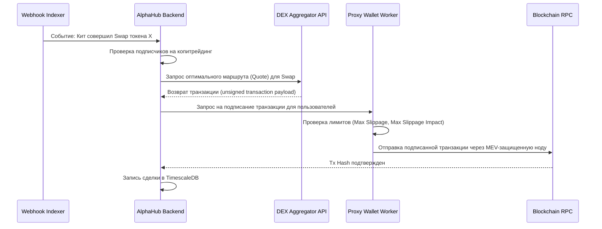

# Production Architecture & Implementation Roadmap: AlphaHub

**Автор**: Winston (Architect BMad Agent)  
**Статус**: Production-Ready Design (Refined with Architectural Feedback)  
**Целевой Стек**: FastAPI (Python), TimescaleDB + PostgreSQL, RabbitMQ, Redis Streams, Telegram Bot API (Aiogram 3), TON/EVM/Solana Webhooks.

---

## 1. Системная Архитектура (System Architecture)

Для масштабирования под тысячи транзакций в секунду и исключения задержек система проектируется как событийно-ориентированная (Event-Driven Architecture) с микросервисной декомпозицией критических компонентов.

```mermaid
flowchart TD
    subgraph Blockchain Network
        TON[TON Blockchain]
        SOL[Solana Blockchain]
        BASE[Base EVM Blockchain]
    end

    subgraph Webhook Indexers
        Tonapi[TonAPI Webhooks]
        Helius[Helius Webhooks]
        Alchemy[Alchemy QuickAlerts]
    end

    subgraph Webhook Gateway
        GW[Stateless Webhook Gateway]
    end

    subgraph Message Broker
        RMQ[(RabbitMQ / Redis Streams)]
    end

    subgraph Workers
        Parser[Block & Event Parser Worker]
        PnL[PnL & Analytics Worker]
        CopyTrade[Copy-Trade Execution Worker]
        BotWorker[Telegram Bot Push Worker]
    end

    subgraph Storage Layer
        PG[(PostgreSQL Core)]
        TSDB[(TimescaleDB PnL & Events)]
        Cache[(Redis Cache & Session Store)]
    end

    subgraph Clients
        TMA[Telegram Mini App UI]
        TG_BOT[Telegram Channel Bot Manager]
    end

    %% Flow connections
    TON --> Tonapi
    SOL --> Helius
    BASE --> Alchemy

    Tonapi -->|HTTP POST| GW
    Helius -->|HTTP POST| GW
    Alchemy -->|HTTP POST| GW

    GW -->|Validate Signature & Push| RMQ
    
    RMQ --> Parser
    RMQ --> PnL
    RMQ --> CopyTrade
    RMQ --> BotWorker

    Parser --> PG
    Parser --> TSDB
    PnL --> TSDB
    CopyTrade --> TSDB
    CopyTrade --> Blockchain Network

    TMA -->|GraphQL/REST API| GW
    TG_BOT -->|Notify / Kick / Invite| BotWorker
```

### Компоненты Системы:
1. **Stateless Webhook Gateway (FastAPI):**
   * Минималистичный бэкенд на FastAPI с обработчиком `ujson`/`rapidjson`.
   * **Продакшен-валидация:** Валидация подписей входящих запросов от провайдеров (например, проверка заголовка `X-Helius-Signature` для Solana или авторизационных токенов TonAPI).
   * Мгновенный сброс сырых данных в RabbitMQ (очередь `raw_blockchain_events`) с ответом `HTTP 200 OK` для исключения таймаутов провайдера.
2. **RabbitMQ Message Broker:**
   * Очередь `raw_blockchain_events` для сырых транзакций.
   * Очередь `processed_swaps` для разобранных DEX-сделок (покупка/продажа токена, цена, объем).
   * Очередь `copy_trade_execution` для отправки транзакций в блокчейн.
   * Очередь `tg_bot_notifications` для пуш-уведомлений.
3. **Event Parser Workers (Асинхронный Python):**
   * Получают сырые транзакции, декодируют смарт-контракты DEX (Ston.fi Router v1/v2, DeDust, Jupiter v6, Uniswap v3).
   * Извлекают параметры: `Token In Address`, `Token Out Address`, `Amount In`, `Amount Out`, `USD Value`.
   * Записывают события в TimescaleDB.

---

## 2. Архитектура Хранения Данных (Database Schema)

Используется гибридный подход: **PostgreSQL** для реляционных данных с транзакционной целостностью и **TimescaleDB** (расширение над PostgreSQL) для хранения временных рядов (транзакции, балансы, снимки PnL) с автоматическим партиционированием (Hypertables).

### 2.1. Реляционные Таблицы (PostgreSQL)
```sql
-- Таблица пользователей
CREATE TABLE users (
    id BIGINT PRIMARY KEY, -- Telegram ID
    username VARCHAR(100),
    is_premium BOOLEAN DEFAULT FALSE,
    premium_expires_at TIMESTAMP WITH TIME ZONE,
    referral_code VARCHAR(20) UNIQUE,
    referred_by BIGINT REFERENCES users(id),
    created_at TIMESTAMP WITH TIME ZONE DEFAULT CURRENT_TIMESTAMP
);

-- Таблица привязанных кошельков трейдеров (B2B)
CREATE TABLE trader_profiles (
    id UUID PRIMARY KEY DEFAULT gen_random_uuid(),
    admin_id BIGINT REFERENCES users(id) ON DELETE CASCADE,
    title VARCHAR(100) NOT NULL,
    description TEXT,
    is_verified BOOLEAN DEFAULT FALSE,
    public_slug VARCHAR(50) UNIQUE,
    created_at TIMESTAMP WITH TIME ZONE DEFAULT CURRENT_TIMESTAMP
);

-- Кошельки трейдера для Proof-of-Trade
CREATE TABLE trader_wallets (
    id UUID PRIMARY KEY DEFAULT gen_random_uuid(),
    trader_profile_id UUID REFERENCES trader_profiles(id) ON DELETE CASCADE,
    blockchain VARCHAR(10) NOT NULL, -- 'TON', 'BASE', 'SOL'
    address VARCHAR(256) NOT NULL,
    created_at TIMESTAMP WITH TIME ZONE DEFAULT CURRENT_TIMESTAMP,
    UNIQUE(blockchain, address)
);

-- Тарифная сетка трейдеров
CREATE TABLE tariffs (
    id UUID PRIMARY KEY DEFAULT gen_random_uuid(),
    trader_profile_id UUID REFERENCES trader_profiles(id) ON DELETE CASCADE,
    duration_days INT NOT NULL,
    price_stars INT, -- Оплата в Telegram Stars
    price_crypto NUMERIC(20, 9), -- Оплата в TON/USDT
    currency VARCHAR(10) DEFAULT 'TON'
);

-- Активные подписки пользователей
CREATE TABLE subscriptions (
    id UUID PRIMARY KEY DEFAULT gen_random_uuid(),
    user_id BIGINT REFERENCES users(id) ON DELETE CASCADE,
    trader_profile_id UUID REFERENCES trader_profiles(id) ON DELETE CASCADE,
    tariff_id UUID REFERENCES tariffs(id),
    status VARCHAR(20) DEFAULT 'ACTIVE', -- 'ACTIVE', 'EXPIRED', 'CANCELLED'
    expires_at TIMESTAMP WITH TIME ZONE NOT NULL,
    invite_link VARCHAR(256),
    created_at TIMESTAMP WITH TIME ZONE DEFAULT CURRENT_TIMESTAMP
);
```

### 2.2. Таблицы Временных Рядов (TimescaleDB Hypertables & Archiving)
```sql
-- Таблица транзакций кошельков (для трекера и Proof-of-Trade)
CREATE TABLE wallet_transactions (
    time TIMESTAMP WITH TIME ZONE NOT NULL,
    tx_hash VARCHAR(128) NOT NULL,
    trace_id VARCHAR(128), -- Связывание TON логических трейсов (асинхронные сообщения)
    logical_time BIGINT, -- Логическое время (lt) для TON для правильной сортировки событий
    wallet_address VARCHAR(256) NOT NULL,
    blockchain VARCHAR(10) NOT NULL,
    dex_name VARCHAR(50), -- 'Ston.fi', 'DeDust', 'Jupiter', 'Uniswap'
    token_in_address VARCHAR(256),
    token_out_address VARCHAR(256),
    amount_in NUMERIC(40, 18),
    amount_out NUMERIC(40, 18),
    usd_value NUMERIC(15, 2),
    tx_type VARCHAR(10) NOT NULL, -- 'BUY', 'SELL', 'TRANSFER'
    PRIMARY KEY (time, tx_hash, wallet_address)
);

-- Превращение в гипертаблицу TimescaleDB с партиционированием по 7 дней
SELECT create_hypertable('wallet_transactions', 'time', chunk_time_interval => INTERVAL '7 days');

-- Настройка сжатия таблиц (TimescaleDB Compression Policy)
ALTER TABLE wallet_transactions SET (
    timescaledb.compress,
    timescaledb.compress_segmentby = 'wallet_address, blockchain',
    timescaledb.compress_orderby = 'time DESC'
);
SELECT add_compression_policy('wallet_transactions', INTERVAL '14 days');

-- Настройка политики хранения данных (Удаление сырых записей старше 90 дней для оптимизации диска)
SELECT add_retention_policy('wallet_transactions', INTERVAL '90 days');

-- Таблица истории доходности (для графиков ROI)
CREATE TABLE trader_pnl_history (
    time TIMESTAMP WITH TIME ZONE NOT NULL,
    trader_profile_id UUID NOT NULL,
    daily_roi NUMERIC(8, 4), -- ROI за текущий день в %
    cumulative_roi NUMERIC(12, 4), -- Накопленный ROI в %
    winrate NUMERIC(5, 2),
    drawdown NUMERIC(5, 2),
    PRIMARY KEY (time, trader_profile_id)
);

SELECT create_hypertable('trader_pnl_history', 'time', chunk_time_interval => INTERVAL '30 days');
```

---

## 3. Криптографический Слой и Безопасность Кошельков

Для полноценного **автоматического копитрейдинга (Copy-Trading)** на бэкенде требуется безопасное подписание транзакций. Использование чисто кастодиальных решений небезопасно, а чистый Shamir's Secret Sharing (SSS) неприменим в 100% фоновом автоматическом режиме, поскольку клиентская доля (Share 1) недоступна, когда пользователь оффлайн.

### Продакшен-решение: Гибридная архитектура безопасности

```
                 [ Варианты Копитрейдинга в AlphaHub ]
                                  |
         +------------------------+------------------------+
         |                                                 |
[ 1-Click Copy-Trading ]                       [ Automated Cloud Copy-Trading ]
   * non-custodial (Пользователь онлайн)          * proxy-custodial (Пользователь оффлайн)
   * SSS (2-of-3) собирается на клиенте           * Выделенный Proxy-кошелек под лимиты
   * Подпись в WASM на устройстве юзера           * Ключ зашифрован через AWS/GCP KMS
   * Безопасность: Абсолютная                     * Безопасность: Ограничена депозитом
```

1. **Сценарий А: 1-Click Copy-Trading (Non-Custodial, Пользователь онлайн):**
   * При срабатывании пуша пользователь переходит в TMA и нажимает «Скопировать».
   * Схема **Shamir's Secret Sharing (SSS) 2-of-3**:
     * **Доля 1 (Клиент):** Хранится локально в Mini App (зашифрована PIN-кодом в IndexedDB).
     * **Доля 2 (Сервер):** Хранится на бэкенде в БД (доступна только транзакционному модулю).
     * **Доля 3 (Резерв):** Шифруется мастер-паролем пользователя и отправляется в Telegram Cloud Storage.
   * При сборке транзакции Доля 1 и Доля 2 объединяются *в оперативной памяти клиента (WASM)*. Транзакция подписывается на устройстве пользователя и отправляется в сеть. Сервер никогда не видит собранный приватный ключ.
2. **Сценарий Б: Automated Cloud Copy-Trading (Пользователь оффлайн):**
   * Для фонового копирования создается выделенный **прокси-кошелек с ограниченным балансом** (Hot-Wallet Vault). Пользователь пополняет его только на сумму, которую готов использовать для копитрейдинга (например, 20 TON).
   * Приватный ключ этого прокси-кошелька шифруется с использованием **KMS (Key Management Service от AWS или HashiCorp Vault)** и хранится на сервере.
   * Воркер копитрейдинга обращается к KMS для расшифровки ключа в RAM во время сборки транзакции. 
   * **Минимизация риска:** В случае компрометации сервера злоумышленник получает доступ только к выделенным прокси-кошелькам с лимитированным балансом, а не к основным кошелькам пользователей.

---

## 4. Архитектура Копитрейдинга и DEX Маршрутизации

Для обеспечения выполнения сделок без проскальзывания и фронтраннинга (MEV) используется следующий пайплайн:



* **Специфика TON (Асинхронность транзакций):**
  * В сети TON перевод Jetton не является атомарной частью транзакции покупки.
  * Для отслеживания результатов сделки воркер должен подписаться на изменения состояния адреса пользователя и отслеживать цепочку транзакций с использованием **Trace ID** и **Logical Time (lt)**.
* **TON DEX SDK:** Интеграция с роутерами Ston.fi (v2 Router) и DeDust напрямую через `ton-core` / `ton-access`.
* **Solana DEX Routing:** Использование **Jupiter API V6** (для получения Payload транзакции) и отправка транзакции через приватные RPC-ноды Jito (MEV-защищенные транзакции для предотвращения сэндвич-атак).
* **Base EVM DEX Routing:** Использование агрегатора **1inch API** или **0x API** для нахождения лучшей ликвидности и минимизации проскальзывания.

---

## 5. Дорожная Карта Вывода в Продакшен (Production Roadmap)

Дорожная карта разбита на логические фазы с фокусом на надежность обработки данных и безопасность пользовательских активов.

```markdown
- `[ ]` ФАЗА 1: Инфраструктурное Ядро и Webhook-пайплайны
    - `[ ]` Развертывание PostgreSQL + TimescaleDB в Docker/Managed Postgres.
    - `[ ]` Создание репозитория бэкенда (FastAPI) и настройка CI/CD (GitHub Actions).
    - `[ ]` Написание шлюза Webhook Gateway с валидацией подписей (Tonapi, Helius, Alchemy).
    - `[ ]` Запуск RabbitMQ и воркера-парсера событий транзакций (декодирование Ston.fi/DeDust/Uniswap v3).
- `[ ]` ФАЗА 2: Протокол Доверия (Proof-of-Alpha) и Telegram Paywall
    - `[ ]` Разработка алгоритма расчета ROI, Winrate и Max Drawdown на исторических данных TimescaleDB с поддержкой TON-трейсинга.
    - `[ ]` Написание Telegram Bot модуля управления правами пользователей (Aiogram 3: инвайты, проверки подписок по расписанию, кик участников).
    - `[ ]` Интеграция платежей: Telegram Stars + TON Connect (проверка платежей по транзакционному хешу на RPC).
    - `[ ]` Создание Frontend (Vite + React 19 + Shadcn/ui) - Лидерборд трейдеров и публичные графики доходности.
- `[ ]` ФАЗА 3: Копитрейдинг и Безопасность
    - `[ ]` Интеграция гибридной схемы копитрейдинга (WASM-SSS для 1-click сделок + KMS для оффлайн proxy-кошельков).
    - `[ ]` Интеграция с API DEX-агрегаторов (Ston.fi, DeDust, Jupiter V6, 1inch) для генерации Swap транзакций.
    - `[ ]` Разработка воркера автоматического копирования (копирование сделок кита/трейдера в течение 1.5-3 секунд после транзакции-триггера).
- `[ ]` ФАЗА 4: Аудит, Бета и Масштабирование
    - `[ ]` Проведение нагрузочного тестирования парсинга транзакций (симуляция 1000 транзакций/сек).
    - `[ ]` Внешний аудит безопасности хранения приватных ключей прокси-кошельков.
    - `[ ]` Запуск закрытого бета-теста с привлечением первых 10 B2B-трейдеров.
```

---

## 6. Рекомендации по Инфраструктуре и Облачному Хостингу

1. **База данных:** Managed Postgres (например, AWS RDS или Supabase с расширением TimescaleDB). Настроено автоматическое сжатие (compression) исторических чанков TimescaleDB старше 14 дней и удаление сырых логов транзакций старше 90 дней.
2. **Кэширование и очереди:** Redis (Managed) для сессий, лимитов API и хранения кэша котировок; RabbitMQ для надежной доставки сообщений.
3. **Блокчейн-ноды:** 
   * **TON:** Платная подписка на TonAPI (уровень Pro/Enterprise для стабильных вебхуков).
   * **Solana:** Helius (тариф Developer/Startup для вебхуков и RPC-транзакций).
   * **Base:** Alchemy или QuickNode.
4. **Мониторинг:** Внедрение Sentry для отслеживания ошибок воркеров транзакций и Grafana/Prometheus для контроля очередей RabbitMQ и нагрузки на базу данных.
