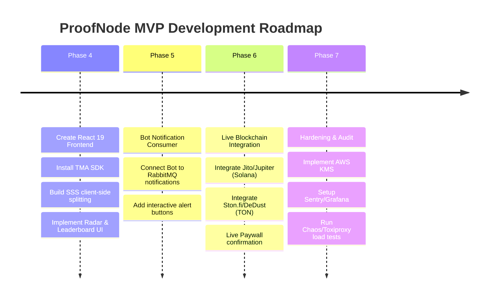

# MVP Gap Analysis: ProofNode Social Copy-Trading Bot

This document provides a technical assessment of the current codebase state after completing Phase 3 and identifies the remaining work required to achieve a production-ready Minimum Viable Product (MVP).

---

## 1. What has been Implemented (Phases 1–3)

We have built a robust event-driven backend and database foundation with complete mock test coverage:

| Component | Implemented Features | Current Implementation State |
| :--- | :--- | :--- |
| **Ingestion Pipeline** | Stateless Webhook Gateway (`/gateway/ton`, etc.), RabbitMQ event broker routing, TimescaleDB hypertables for transactions. | Production-ready structure with dev mock validation. |
| **Paywall & Subscriptions** | aiogram-based TG bot community manager, invite link generation (`create_chat_invite_link`), expiration worker (auto-kicking members). | Core logic is fully testable; blockchain payments verify via mock checks. |
| **Wallet Security** | SSS 2-of-3 server-share API, KMS-encrypted proxy wallet generation (using `cryptography.fernet` symmetric encryption stub). | Secure key management architecture validated. |
| **Copy-Trading Engine** | Copy job trigger evaluation in Event Parser, async copy worker (`copy_worker.py`), mock DEX aggregator quotes & broadcasting. | Completed and verified with end-to-end integration tests. |

---

## 2. Gaps: What is Missing for a Working MVP?

To convert the current mock sandbox into a live-operating product, the following components must be implemented:

### ⚠️ Gap A: Frontend UI (Telegram Mini App)
- **Current State:** The frontend does not exist in the codebase.
- **MVP Requirement:** We need a React/Vite/TypeScript frontend running inside the Telegram Mini App using the Telegram WebApp SDK and `@tonconnect/ui-react`.
- **Key Screens Needed:**
  1. **Radar Tab:** Search & add monitored smart-money addresses; toggle push switches.
  2. **Marketplace Tab:** Trader leaderboard with interactive charts showing ROI/PnL, tariff checkout forms.
  3. **Cabinet Tab:** Interactive Shamir's Secret Sharing (SSS) key generation/splitting (runs in browser WebAssembly/RAM so the user's private key never touches the server), proxy wallet deposits/withdrawals.

### ⚠️ Gap B: Real-world Blockchain Integrations (RPCs & Indexers)
- **Current State:** All blockchain checks are stubbed out for TON, Solana, and EVM (Base).
- **MVP Requirement:**
  1. **Webhook Validation:** Replace the signature stubs with real HMAC or cryptographic validation for Helius (Solana), TonAPI (TON), and Alchemy (Base) webhook headers.
  2. **RPC Node Queries:** Connect to live RPC nodes (e.g. `pytonconnect` or standard RPC JSON-endpoints) to check proxy wallet balances and paywall transaction hashes.
  3. **Real Signing & Broadcasting:** Replace the mock transaction broadcaster in `dex.py` with standard library calls (like Web3.py for Base, Solana-py for SOL, and Ton-core for TON) to sign and broadcast the serialized transactions.

### ⚠️ Gap C: Telegram Bot Notification Consumer
- **Current State:** The copy worker publishes 1-Click alerts to `tg_bot_notifications`, but the bot (`bot/main.py`) does not consume from this queue.
- **MVP Requirement:** Add a background consumer task inside `bot/main.py` that listens to `tg_bot_notifications` in RabbitMQ and sends rich messages (e.g. *"New Trade detected! [Copy Now Button]"*) with a inline button that deep-links into the TMA.

### ⚠️ Gap D: Production Key Management Service (KMS)
- **Current State:** The KMS service uses a local Fernet key derived from a plaintext setting.
- **MVP Requirement:** Integrate the `KMSService` with a real cloud HSM provider (like AWS KMS or HashiCorp Vault API) to encrypt and decrypt the user's proxy wallet private keys securely using envelope encryption.

### ⚠️ Gap E: Live DEX Aggregator APIs
- **Current State:** Quotes and routes are simulated with mock outputs.
- **MVP Requirement:** Fetch real swap transaction payloads and quotes from:
  - **TON:** Ston.fi API or DeDust SDK.
  - **Solana:** Jupiter V6 API.
  - **Base:** 1inch or 0x API.

---

## 3. Recommended MVP Roadmap

---
